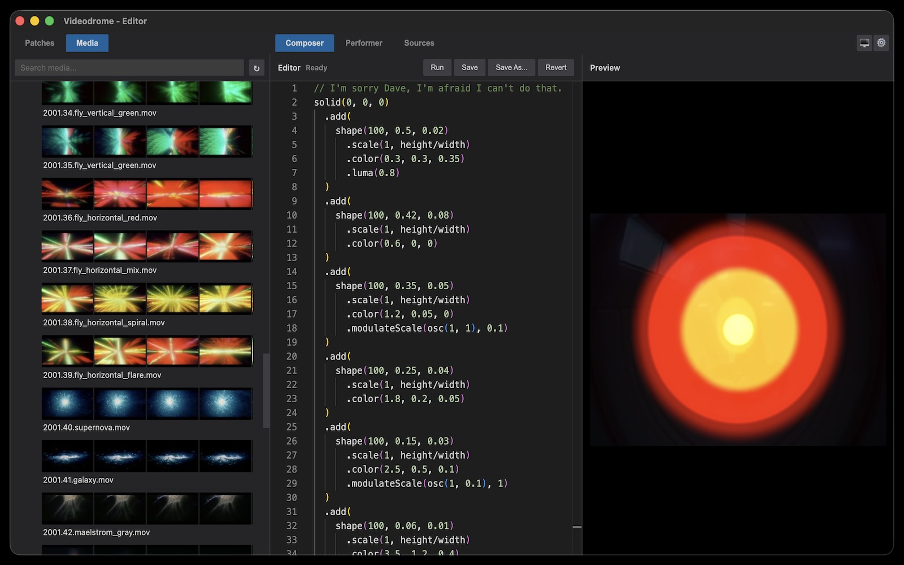

# Videodrome

A live visuals environment for video synthesis using [Hydra](https://hydra.ojack.xyz/) wrapped in Electron. Write and test Hydra patches in the **composer** and use them for live performance in the **performer**. Manage patches and media with two dedicated explorers and preview Hydra sources in a separate source tab.



## Main tabs

Videodrome provides the following three main tabs:

- **Composer tab (Cmd+1 / Ctrl+1)**: Single editor with live preview.
- **Performer tab (Cmd+2 / Cmd+3 / Ctrl+2 / Ctrl+3)**: Two editors and compositor, rendering to separate output window.
- **Sources tab (Cmd+4 / Ctrl+4)**: Preview Hydra sources `s0`–`s3` and adjust playback speed

## Patch and media explorers

The sidebar provides the following two explorers:

- **Patch explorer** to manage patches. Right‑click or drag a patch into an editor. Run with Cmd+Enter / Ctrl+Enter. Default path for macOS is `~/Documents/Videodrome/patches` (configurable in settings).

- **Media explorer** to manage media (`jpg`, `png`, `gif`, `mov`, `mp4`, `webp`). Right‑click to assign to a source slot (`s0`–`s3`). Previews are generated on the fly. Clear and regenerate all previews via the top‑right icon. Default path for macOS is `~/Documents/Videodrome/media`.

## Intellisense and parameter controls

The patch editors are built on Monaco and come with Intellisense.

To quickly edit parameters, hover over numbers (or move cursor and press Shift+Enter) to open a widget for value adjustment using mouse or keyboard. Drag lock and sensitivity can be configured in settings.

## Hydra patches

Most Hydra patches should run unmodified. See [Hydra](https://hydra.ojack.xyz/) home page for documentation and contributed patches.

## Security

Only open patches from sources you trust. Patches execute as JavaScript inside the app context; malicious code could affect files the app exposes. Treat patches like executables.

## Installation

```bash
npm install
```

## Development

```bash
npm run dev
```

## Distribution (macOS, other platforms currently untested)

```bash
npm run dist:mac
```

## Tech stack

Electron • TypeScript • Monaco • Hydra-synth • Vite

## License

MIT – see `LICENSE`.

Written by Stefan Arisona ([robotized.arisona.ch](https://robotized.arisona.ch) [github.com/arisona](https://github.com/arisona))
